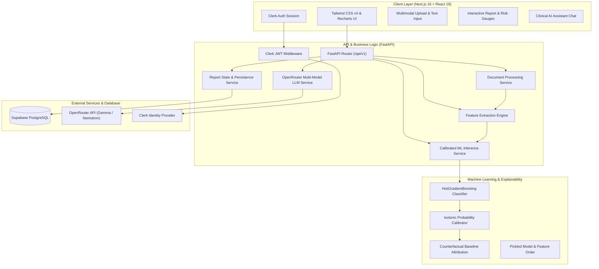

# HealthLens AI - System Architecture & Technical Design

## 1. High-Level Architecture Overview

HealthLens AI is engineered as a decoupled, microservice-ready system uniting modern frontend engineering, high-throughput asynchronous backend APIs, clinical machine learning inference, and multimodal document understanding.



---

## 2. Component Breakdown

### A. Frontend Layer (Next.js 16 App Router)
* **Framework**: Next.js 16 with React 19, exploiting Server Components where static content dominates and hydrating lightweight interactive leaves for stateful forms, charts, and file uploaders.
* **Component Design**: Strictly adheres to single-responsibility component composition:
  - `HealthScoreCard`: Renders calibrated probability gauges and categorical risk bands (Low, Moderate, High, Very High).
  - `BiomarkerImpactList`: Visualizes positive and negative counterfactual risk contributions.
  - `AssistantChat`: Conversational interface retaining conversation history and active patient report context.
  - `MissingFeaturesModal`: Interactive questionnaire dynamically generated when uploaded documents omit mandatory clinical features.
* **State Management**: Derived state computed during render, custom hooks (`useReport`, `useAssistant`, `useAuthProfile`) encapsulating API calls and loading/error states.
* **Styling**: Tailwind CSS v4 design tokenization ensuring responsive layouts and high contrast accessibility.

### B. API & Application Layer (FastAPI)
* **Asynchronous Engine**: Built on Starlette/Uvicorn, ensuring non-blocking I/O during heavy document parsing and LLM streaming.
* **Request Validation**: Pydantic v2 schemas enforce strict types on all clinical features and inbound payloads.
* **CORS & Security Middleware**: Environment-aware origin verification supporting local development and automated regex patterns for preview deployments (`*.vercel.app`).
* **Authentication Boundary**: Clerk Bearer JWT decoding with fallback verification for local development test environments.

### C. Multimodal Document Processing Pipeline
1. **File Ingestion**: Accepts PDF, DOCX, TXT, and images (PNG, JPG, JPEG, WEBP) up to 10MB.
2. **Text Extraction**:
   - Word Documents: `python-docx` extracts structured paragraphs and table cells.
   - Text/Scanned PDFs: `pypdf` extracts text layers; falls back to embedded image extraction when documents lack digital text.
   - Images & Scanned Lab Panels: Pillow optimizes dimensions (<1400px) and base64 encodes image data to query multimodal vision models (`openrouter/free`, `nvidia/nemotron-nano-12b-v2-vl`).
3. **Feature Mapping**:
   - Hybrid pipeline: High-speed regex parses clear deterministic terms (e.g. `BMI: 28.4`, `Hypertension: Yes`).
   - LLM clinical extraction identifies nuanced or contextual clinical mentions.
   - Missing feature evaluation generates targeted follow-up prompts to guarantee all 21 inputs are accounted for.

### D. Machine Learning & Explainable AI (XAI)
* **Inference Pipeline**: Scikit-Learn `HistGradientBoostingClassifier` trained on CDC BRFSS epidemiological data.
* **Probability Calibration**: Raw ensemble scores pass through an `IsotonicRegression` calibration curve, adjusting probabilities to match empirical prevalence.
* **Counterfactual Risk Factor Attribution**:
  - Compares the patient's calibrated risk probability $P(\mathbf{x})$ against a baseline profile where a single feature is set to its neutral/healthy value.
  - Calculates the exact change $\Delta P = P(\mathbf{x}) - P(\mathbf{x}_{i \leftarrow \text{baseline}})$.
  - Classifies factors into `increases_risk` or `decreases_risk` and sorts them by magnitude.

---

## 3. Data Flow & Screening Lifecycle

```
[User] -> (Uploads Lab Report or Enters Clinical Text)
   │
   ▼
[FastAPI /api/v1/reports/upload]
   │
   ├─► 1. Save file to temporary workspace
   ├─► 2. Extract text & tabular data (Docx / PyPDF / Vision LLM)
   ├─► 3. Parse 21 clinical parameters (Regex + LLM)
   │
   ▼
[Check Completeness]
   ├── Missing Features Found?
   │     └── Return status: "needs_info" + list of missing questions to UI
   │
   └── All Features Present?
         │
         ▼
[Run Calibrated ML Inference Engine]
   ├─► HistGradientBoosting model predicts risk probability
   ├─► Isotonic calibrator adjusts score
   ├─► Counterfactual finite-difference calculates feature attributions
   ├─► OpenRouter synthesizes personalized clinical recommendations
   │
   ▼
[Save to Supabase / In-Memory Cache]
   │
   ▼
[User Views Interactive Report Dashboard]
   │
   ▼
[User Queries AI Health Assistant With Grounded Report Context]
```

---

## 4. Security & Compliance Architecture

* **Zero-Retention Option**: Uploaded binary documents can be immediately unlinked post-extraction to comply with healthcare data minimization standards.
* **Token-Based Authentication**: Secure Clerk session tokens passed as `Authorization: Bearer <JWT>`. Backend verifies issuer claims before executing user-scoped queries.
* **Row-Level Security (RLS)**: Supabase PostgreSQL tables maintain user ownership separation (`user_id = auth.uid()`).
* **Environment Secret Segregation**: No API keys or connection strings are committed into version control; clean `.env.example` templates define required variables.
